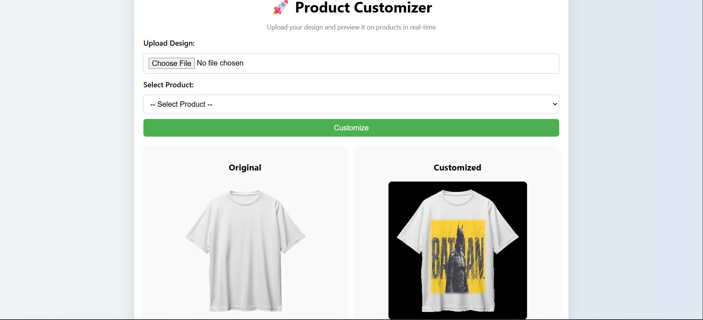
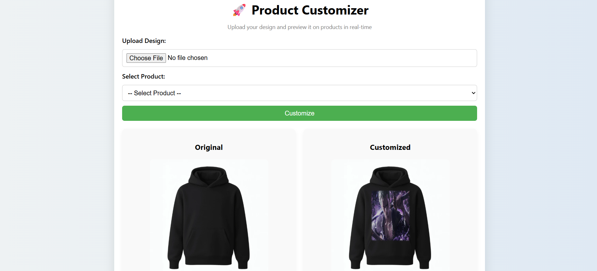
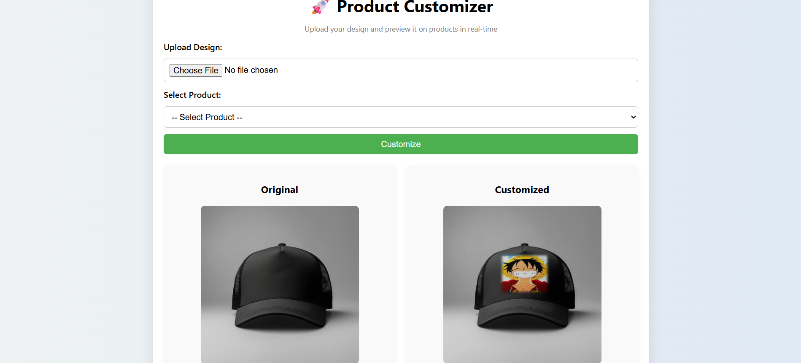

# 🚀 Product Customizer – Realistic Image Rendering System

A web-based product customization system that allows users to upload designs and visualize them on apparel (T-shirt, Hoodie, Cap) with **realistic rendering**.

Unlike basic tools that simply paste images, this system simulates how designs interact with fabric using **lighting, shadows, and surface-aware blending**.

---

## 🌐 Live Demo

👉 [https://product-customizer-9l15.onrender.com/](https://product-customizer-9l15.onrender.com/)

---

## 📷 Demo / Screenshots










---

## 🎯 Problem Statement

Most product customization tools produce unrealistic outputs by directly overlaying designs.

This project solves that by:

* Adapting designs to product surfaces
* Preserving lighting and shadows
* Simulating fabric interaction

---

## ✨ Key Features

* 🧥 **Multi-product support**

  * T-shirt
  * Hoodie
  * Cap

* 🎨 **Realistic rendering pipeline**

  * Shading-aware blending
  * Edge feathering
  * Texture preservation

* 📐 **Dynamic scaling**

  * Adjustable design size

* 🧠 **Fabric-aware simulation**

  * Design adapts to wrinkles and lighting

* ⚡ **Fast processing**

  * Optimized OpenCV pipeline

* 📥 **Downloadable output**

---

## 🧠 How It Works

### 1. Design Upload

User uploads an image (PNG/JPG).

---

### 2. Print Area Mapping

Each product has predefined coordinates for placing the design.

---

### 3. Rendering Pipeline

#### 🔹 Shading Extraction

* Convert product region to grayscale
* Extract lighting patterns (wrinkles/shadows)

#### 🔹 Fabric Conformation (Simulation)

* Apply lighting map to design
* Simulates fabric folds and texture

#### 🔹 Realistic Blending

* Combine design with product using alpha blending
* Maintains shadows and highlights

#### 🔹 Edge Feathering

* Smooth edges using Gaussian blur
* Removes sharp rectangular boundaries

---

## 🛠 Tech Stack

* **Backend:** Django (Server-Side Rendering)
* **Image Processing:** OpenCV, NumPy
* **Frontend:** HTML, CSS (Django Templates)
* **Deployment:** Render

---

## ⚡ Performance & Scalability

* Efficient image processing for quick rendering
* Designed to scale using:

  * Background workers (Celery + Redis) *(future scope)*
* Stateless architecture supports concurrent requests

---

## 🏗 Project Structure

```plaintext
product_customizer/
│
├── customizer/           # Core logic (views, processing)
├── customizer_project/   # Django settings
├── media/
│   ├── products/         # Product images
│   ├── uploads/          # User uploads (ignored)
│   └── outputs/          # Generated images (ignored)
├── screenshots/          # README images
├── templates/
├── manage.py
```

---

## ⚙️ Setup Instructions

```bash
# Clone repository
git clone https://github.com/AmanulFarhan/product-customizer.git

# Navigate to project
cd product-customizer

# Create virtual environment
python -m venv venv
source venv/bin/activate   # Windows: venv\Scripts\activate

# Install dependencies
pip install -r requirements.txt

# Run server
python manage.py runserver
```

---

## 🚀 Deployment

Deployed on Render using:

* Gunicorn (WSGI server)
* WhiteNoise (static file handling)

---

## 🔮 Future Improvements

* Automatic perspective detection
* Advanced displacement mapping
* Admin panel for dynamic product configuration
* AI-based fabric simulation
* Cloud storage for media (AWS S3)

---

## 👨‍💻 Author

**Amanul Farhan K S**
Computer Science Student | Full Stack + AI Enthusiast

---

## 🏆 Key Highlight

> This project goes beyond simple image overlay by simulating how designs interact with fabric using shading-based rendering techniques.
